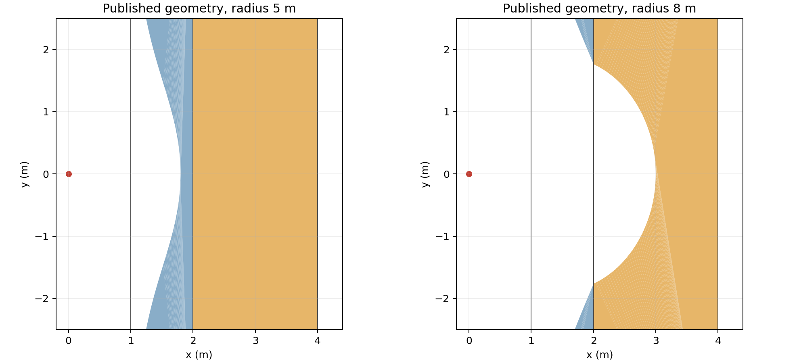

# Bounded blast conformance experiment — revised Phase 2

2026-10-09. **83/83 EditMode and 15/15 PlayMode pass.** The original wide cover/core cases, narrow retained geometry, full structural planner, recovery and existing held-bomb regression now succeed. The largest independent measured radial deficit is **0.777 mm**, within the retained **1 mm** bound. Computation is expensive: median host times range from 29 ms for the narrow fixture to 3.05 s for a recovered second layered blast. A sharp opaque-support shadow remains a measured atomic-rejection limitation.

The approved [Phase 1 proposal](BlastConformancePhase1.md) is unchanged. [Revised evidence](BlastConformanceEvidence/2026-10-09-revision-1/README.md) includes all leaf verdicts, independent measurements, snapshots, exact invocations and checksums. The [earlier failing evidence](BlastConformanceEvidence/2026-10-09-phase2/README.md), its source checksums, and an exact [copy of the earlier report](BlastConformanceEvidence/2026-10-09-revision-1/prior-prototype/BlastConformance.md) are preserved.

## Baseline and scope

Implementation checkout: `C:\Users\jblic\Desktop\Bomb\.worktrees\blast-conformance-probe`, branch `feature/blast-conformance-probe`, based directly on experiment commit **3f652e9178a78777bd41514441229827f7e611ad**, without a merge. James approved Phase 2, opaque indestructible cover, separate commits in stable body-ID order, and the recovery approach. His continuation permitted numerical-method/budget revisions and requested uncommitted results. The evidence records that uncommitted review state. After reviewing the results, James explicitly authorized committing and pushing this implementation and report to the remote branch.

Normative supplied checkpoint: Handbook **1.5.0**, Architecture **v0.13**, decisions through **DEC-066**. `BOM-Handbook-1.5.0-Source.zip` SHA256 is `49deb9ece85b84086ed4b3dcccd76bcc32e518f1c9d91210d5bc3343098491f8`; its embedded and independently recomputed sourceHash is **ef1d9430e490e7b4757e38f57daf12b1dfe19ff3cd2272610aea3147f9e93a0c**. The prepared checkpoint supplies no Git revision. Phase 1 records the complete ordered reading, all 15 checkpoint hashes and all six source comparisons. Published `gh-pages` at inspection was `65cd6086626d916f99b9389c589fecf9356bf67d`, the older 1.4.0 checkpoint, which was not substituted.

The original checkout remains clean at `5960ed4e16efc5e3bf21489fb38b6ce429229c04`; the earlier handbook probe remains clean at the exact experiment base; the report checkout remains clean at `2f77c10df7bc18ff678681ed88918345c99bfd43`. No applicable AGENTS.md was found in the inspected ancestry/project paths. The installed Unity CLI and legacy 2D physics skill instructions were used. Handbook, assignment prototype, packages, solver settings and existing reports are unchanged.

## Method and numerical changes

Each independent explosion captures original candidate geometry, selected immutable materials and world generation. Only the source bomb is excluded. Each body's convex ray intervals are unioned before charging material, so internal cell seams and cavities do not create duplicate costs. The calculation remains:

`cost(s) = s + sum(resistance × original crossed thickness)`.

Ordinary distance is charged inside material as well as air. Removing cover in a planned result never refunds its cost. Indestructible material stops carving and exposure behind its original first entry. Geometry and character exposure use this same original-world calculation; target iteration cannot change it.

The original constant lower-reach fan required at least 12,800 sectors for radius 5 under the old variation criterion and failed its 4,096-sector cap. The revision uses **varying-endpoint inner and outer chords**. It seeds angular intervals at coordinate axes and vertices of resistive/opaque material and characters. Zero-resistance subtractable environment adds no cost event: ordinary distance already counts its travel, and batch subtraction still considers its entire shape.

Within each original edge-order interval, intersections have the form `h/(n·u(theta))`. Reach inversion uses the original intervals. Each chord is split at its crossings with material entry/exit lines; a bound on the cost's second derivative gives the whole-interval interpolation remainder `M × angularWidth² / 8`. The inner chord must stay within budget everywhere; the outer chord must exceed it or meet an original opaque barrier everywhere. Checking endpoint/central arithmetic alone does not authorize a sector.

Uniform seeding near the permitted chord pitch avoids unnecessary binary oversampling. Adjacent sectors can then merge only when both chords pass certificates over **every constituent original interval**, including its original active material edges. True one-sided shadow jumps are retained. This coalescing fixed the additional recovered-second-blast tiny facet without erasing material features or increasing the error bound.

| Current numerical convention / cap | Value |
|---|---:|
| Tested nominal radius / resistance | 0.25–10 m / 0–16 |
| Coordinates / relevant vertices | Positions within ±64 m; transformed vertices within 32 m of origin |
| Tested positive-width features and clearances | At least 0.02 m; exact shared faces also tested |
| Candidate bodies / input cells / input edges | 32 / **512** / **4,096** |
| Fan sectors / refinement depth | **8,192** / 24 |
| Chord sagitta / inward endpoint allowance | 0.25 mm / **0.40 mm** |
| Float conversion gate / total radial deficit gate | 0.05 mm / **1 mm** |
| Half-plane clips / retained pieces per body | **262,144** / **8,192** |
| Arrangement vertices per body / final cells per connected result | **16,384** / 512 |
| Final angular certificate / adaptive exact rays | 16,384 events / 4,096 rays |
| Lossless diagonal optimization | 512 passes; 1,000,000 adjacent-pair checks per explosion |

The former constant-reach variation criterion is replaced by the chord enclosure/error checks. Input/fan/partition budgets were increased within James's continuation authorization, mainly to permit a second blast against the first result's cell decomposition. These caps bound operation counts, not real-time latency. They are experimental choices, not handbook requirements or tuning defaults.

The backend remains convex half-plane clipping. A single batch retains every positive-area intermediate remainder. Shared subdivision edges cancel in double precision; resulting boundary contours are triangulated, convex unions merged, and adjacent triangle diagonals changed losslessly when needed to meet authored cell thresholds. Unaffected input cells are reused. No retained fragment is deleted to repair a breach. Arithmetic guards remain 1e-10 for area/interval checks, 1e-11 m for arrangement welding, and 1e-12 for merge/predicate calculations; they are distinct from positional tolerances. Canonical edge, convexity, area and selected response thresholds remain intact. General enclosed-hole repartition remains unproven; its fallback retains the original partition and can reject.

Float-safe merges retain T-junction vertices unless they remain exactly collinear after conversion. Fresh split results use an exactly representable dyadic local-frame shift, or retain the original frame, to avoid moving original shared faces through separately rounded centroid subtraction and world-position addition. This is an existing representation convention: WORLD-006 / DEC-057 permit a local origin distinct from COM. The existing result policy computes motion once before that exact frame change. Measured local-origin/COM offsets reach 5.753 m in the second-blast fixture; no impulse, relocation or solver change was introduced.

Finally, original/result vertices and edge crossings partition the actual published geometry's radial ordering. A retained interval before later removed material rejects the explosion, even for a gap smaller than 1 mm. Nearly tangent double arithmetic can invent a nanometre gap; an adaptive **exact binary-rational predicate** resolves those cases using the authored floats and their affine transforms. `System.Numerics.BigInteger` is the existing .NET base library, not a new package or canonical encoding. The independent [rational diagnostic](BlastConformanceEvidence/2026-10-09-revision-1/exact-continuity-result.json) verifies one previously reported gap was arithmetic cancellation. A deliberately retained **20 µm** sheet still rejects buried core removal.

## Ownership, definitions and gameplay

| Files | Owned change |
|---|---|
| `CanonicalDefinitions.cs` | One immutable authored material resistance, explicit presence, finite nonnegative validation and existing content hashing |
| `CanonicalMaterialSnapshot.cs` | Schema 3; existing current-definition dependency closure; reject missing resistance/schema 2 without migration |
| `HandbookConformanceFixture.cs`, `BlastConformanceFixture.cs` | Explicit resistance 0 on newly constructed old fixtures; new illustrative cover/core/narrow values 4/1/16 and densities 2/3/2 |
| `BoundedBlastEvaluator.cs` | Frozen original inputs, layered cost, opacity, exposure, bounded fan and final actual-geometry certificate |
| `BoundedBlastGeometry.cs`, `DestructionGeometry.cs` | Strict batch path and lossless repartition beside the unchanged direct cutter |
| `CanonicalDestructionService.cs` | Resolve selected response and evaluate the common original-generation field |
| `CanonicalSimulationHost.cs` | Per-explosion complete result, reviewed ordering, same-ID/shape death and exact split-frame handling |
| New EditMode/PlayMode files | Independent expected outcomes, published geometry/collider/mass checks, recovery, atomic rejection and live physics/fuse evidence |
| Existing `HandbookConformanceTests.cs` | Only its schema-specific rejection literal changes from 2 to 3; assertion preserved |
| Reports and dated evidence | Reproducible state, numerical measurements, verdicts, failures and provenance |

The complete existing structural planner still owns ID reservation, 0/1/many identity, connector failure before replacement, held-location mapping, control clearing and publication. Runtime adapter, canonical polygon representation and physics step/solver remain unchanged. Resistance does not derive from density, connector strength or destruction response. Existing saved schema-2 data is rejected; fixture resistance 0 is fresh authoring, not an approved historical migration.

Exposure proves a positive angular aperture to the original character's front surface within the same accumulated budget and without earlier opaque material. A character's own opaque selection still permits front-surface exposure and blocks continuation behind it. The power threshold 1 and this overlap convention remain fixture/experiment choices. An unresolved pure tangent rejects rather than selecting a boundary-lethality policy.

The killing explosion preserves body ID, shape and geometry revision, installs the existing authored corpse configuration, clears control/outgoing holds and preserves valid incoming holds. A subsequent independent blast uses the corpse's ordinary selected response. Simultaneously due bombs commit in stable body-ID order before the next evaluates the current world, without another physics/fuse step. Explicit calls use caller order. No persistent blast, whole-tick immunity, chain reaction or new tick architecture was added.

## Complete test results

Unity **6000.2.14f1**, Unity CLI **1.0.0-beta.10**, installed integration retained. Both actual assemblies ran through `run_tests` with assembly filters, async execution and completed `test_status` leaf verdicts. [Exact invocations](BlastConformanceEvidence/2026-10-09-revision-1/invocations.log) include project path, caller/skill labels and parameters.

| Final assembly / subset | Passed | Failed | Skipped / inconclusive |
|---|---:|---:|---:|
| EditMode complete | **83 / 83** | 0 | 0 / 0 |
| Existing EditMode | 50 / 50 | 0 | 0 / 0 |
| New EditMode | 33 / 33 | 0 | 0 / 0 |
| PlayMode complete | **15 / 15** | 0 | 0 / 0 |
| Existing PlayMode | 12 / 12 | 0 | 0 / 0 |
| New PlayMode | 3 / 3 | 0 | 0 / 0 |

Final [EditMode verdict](BlastConformanceEvidence/2026-10-09-revision-1/final-edit-verdict.json): **22.38 s**. Final [PlayMode verdict](BlastConformanceEvidence/2026-10-09-revision-1/final-play-verdict.json): **5.36 s**. Async start envelopes with zero counts are not verdicts. Intermediate failing runs and rejected plans remain in the evidence.

| Obligation / rule | Observed evidence |
|---|---|
| Empty space, WORLD-007 | Four radii; 10,001 independent directions each. Largest empty-field deficit 0.646 mm at radius 10, no measured overreach |
| Original wide cover/core, WORLD-007/008/009 | Radius 5 cover penetration **0.799600005 m**, retained thickness **0.200399995 m**, identical core; radius 8 core penetration **0.999599934 m**, continuously breached cover |
| Full 2D opening | Radius 8 cover becomes two fresh-ID bodies; connected indented core keeps its ID. Cover-back opening half-height **1.763634086 m**, analytic **1.763834207 m** |
| Original-cost/no-refund and order | Planned removed cover still consumes original resistance; forward/reverse target ordering produces equal independently probed geometry and exposure |
| Shielded character, WORLD-010 | Character behind both wide layers remains alive inside nominal radius 8; direct-path cost exceeds reach. Opaque barriers protect both geometry and characters |
| Death / next explosion, CHAR-006 | Same ID/shape and authored corpse settings; control/outgoing holds cleared, incoming hold retained; next independent blast carves corpse; simultaneous expiry commits separately in ID order |
| Full structural result | Real planner checks old connector 0.6 threshold failure, two replacements from the surviving 0.4 threshold connector, inherited inputs, density × independently measured area, point velocity and destroyed/surviving held points |
| Recovery / MAT-010 | Capture/rebuild before and after layered and death results; resistance/hash dependency checks; recovered rotated second layered blast succeeds without a retired parent or replay |
| Robustness | Translation (12,-9), rotations 17°/37°/90°, 0.02 m narrow layers including 37° orientation, cavities and reversed cell enumeration; covered L corner remains shielded while a separate exposed character dies |
| Atomic rejection | Overlap/embedded origin, unresolved tangent, authored minimum-area failure, deliberate retained-sheet breach and recorded opaque-support corner reject without structural publication; saved rejected snapshots are byte-identical |
| Existing held-bomb regression | Original expectations pass: physically falling/held bomb expires after 400 active ticks from **(-1.34882975, 3.76241326)**; atomic carving/death/control/hold cleanup observed; platform area **5.50288534 m²** |

Independent centre arithmetic remains cost **6 m** to the core and **10 m** through both original layers. Geometry expectations use closed-form off-axis boundaries, not evaluator results. The new full-planner fixture's surviving held point changed from (1,5), which is actually exposed at radius 8, to analytically protected (2,5). No existing hold expectation changed.

The held-bomb regression had two numerical causes: a near-tangent subdivision seam and retained cells below the **unchanged 0.01 m²** authored threshold. Shared-boundary reconstruction, exact cancellation predicates, lossless repartition and the coarser certified fan repair them. Earlier failures down to 0.007088 m² and subsequent 0.008853/0.009492 m² retained cells remain recorded. No area threshold, hold reach, solver or historical test was weakened.

## Accuracy and cost

[Independent measurement code](BlastConformanceEvidence/2026-10-09-revision-1/MeasureAccuracy.py) clips rays against serialized published polygons using its own arithmetic. It imports no implementation evaluator. It measures 10,001 rays per wide/thin/rotated boundary and 20,001 per narrow case, including fully removed rays and the permitted inward guard band. Wide symmetric difference uses independent slab-cost algebra with 4,000/8,000/16,000-ray integration; resolution doubling reports convergence, not a formal integration proof. Direct shoelace areas are also compared with closed-form analytic removed areas.

| Actual published boundary | Maximum measured deficit |
|---|---:|
| Radius 5 cover | 0.448 mm |
| Radius 8 partial cover / core | 0.416 / 0.603 mm |
| Translated, rotated 37° core | 0.601 mm |
| Narrow 0° / 37° | **0.777 / 0.540 mm** |
| Thin unbreached cover | 0.446 mm; central retained thickness 0.010399938 m |

Wide measured symmetric differences are **0.00239423 m²** (radius-5 cover), **0.00160969 m²** (radius-8 cover) and **0.00206986 m²** (radius-8 core). Corresponding analytic-minus-polygon area deficits are 0.00239407 / 0.00160973 / 0.00206989 m². The final doubling differences are at most **1.33e-7 m²**. All are below the 1 mm radial-area enclosures, 0.03141593 m² at radius 5 and 0.05026548 m² at radius 8. Measured overcut integration is below 7e-16 m², numerical roundoff. These are measurements on listed fixtures, not a proof for arbitrary polygons.

[Benchmark records](BlastConformanceEvidence/2026-10-09-revision-1/benchmark.json) contain one warmup plus five measured actual host detonations per case, **48/48 completed successfully**. Construction, first detonation/recovery preparing the second-blast case, and runtime projection are outside the stopwatch. Field, subtraction, continuity checks, planner and canonical publication are inside. The initial CLI response timed out at its transport's 30 s limit, but the synchronous evaluator continued, wrote all 48 records, and the later Editor restoration receipt independently confirmed completeness. No partial batch is reported as complete.

| Case | Median ms | Min–max ms | Sectors | Result cells | Half-plane clips |
|---|---:|---:|---:|---:|---:|
| Wide radius 5 | 675.36 | 602.15–969.41 | 364 | 80 | 1,336 |
| Wide radius 8 | 639.85 | 603.08–885.10 | 512 | 108 | 1,880 |
| Wide radius 8 + protected character | 826.84 | 611.04–1,827.83 | 512 | 110 | 1,880 |
| Wide radius 8, rotated 37° | 1,228.31 | 1,012.38–1,315.07 | 511 | 109 | 1,880 |
| Narrow 0° / 37° | 29.07 / 32.12 | 25.87–29.85 / 28.94–32.64 | 326 / 334 | 8 / 13 | 96 / 152 |
| Thin layer | 33.93 | 30.74–38.71 | 150 | 17 | 344 |
| Recovered second layered blast, 37° | **3,052.83** | 2,970.61–3,181.28 | 595 | 104 | 36,668 |

Maximum benchmark float-conversion drift is **0.245 µm** against the 50 µm gate; reported whole-field deficit enclosures stay below 1 mm. Five samples do not establish percentiles or a worst-case latency bound. The high rotated/second-blast cost includes adaptive exact predicates and repartition of many input cells. This implementation is a conformance experiment, not demonstrated real-time gameplay performance.

## Live landing and remaining limits

The real layered landing fixture keeps the required wide `x=1..2` cover and `x=2..4` core with `y=±6`. Static environment/character role selections are explicit fixture authoring. A dynamic bomb falls from y=2 onto an opaque **0.1 m-wide** support; the support's shadow lies outside those layers within reach 8. Each radius lands in **30 physical host ticks**, activates the authored 8 s fuse once, captures/rebuilds, then expires after **400 active ticks** at approximately **(-0.0000009903, 0.415031165)**.

Each produces exactly one complete publication, retains the protected character and unchanged opaque support, checks collider paths against canonical cells, checks actual central/off-axis cover/core geometry, and captures/rebuilds the result. Radius-5 central cover front is **1.799600720 m**; radius-8 core front is **2.999600410 m**. Runtime/canonical masses agree with independently measured collider area and authored density; maximum recorded mass error is about **7.15e-6**. Total 400-tick expiry-loop wall times are 1,003.46 / 989.61 ms; these include physics and projection and are not single-detonation benchmark times. The separate wide opaque-foundation landing test also passes.

The original **0.4 m-wide support** attempt is preserved in [rejected-support-corner](BlastConformanceEvidence/2026-10-09-revision-1/rejected-support-corner/). Radius 5 succeeded after fan coalescing. Radius 8 at the reachable float pose (-0.0000037440,0.4150001705) still generates a rounded shadow edge that would retain cover before removing material farther along the same path. The exact final predicate rejects at **5.161481675137069 rad**, including an original opaque interval only about 3.93e-9 m long. The world/allocator snapshots before and after an explicit rejected detonation are byte-identical and notifications remain zero. The new `RecordedOpaqueSupportCorner` test keeps this as a negative representability case. Narrowing the new landing support isolates the required layered arithmetic; it does not repair, conceal or certify this discontinuity. Existing tests and original wide-layer expected outcomes are unchanged.

Other unsupported/unproven inputs include positive-area cross-body composition, an origin on/inside another body, unresolved boundary-only character contact, arbitrary enclosed-hole output, features below the tested width/clearance, larger input/cell/clip budgets and arbitrary geometry near validation thresholds. Rejections preserve that explosion's structural state; an earlier independent explosion already committed is not rolled back. Routine physics/fuse advancement before a rejected Tick remains distinct from atomic structural publication.

The old extreme-force hold issue remains separate: **6.15577459 m** transient stretch for **1.5 m** authored reach, settling to 1.49999988 m after 40 steps. No solver setting, clamp, reach change or artificial release was introduced. Production networking, controls/matches, blast impulses, shattering, art and historical-save migration remain outside scope.

## Final workspace and infrastructure

Final Editor PID **8436**, exact isolated project, Play stopped, pause false, compilation idle without errors; console ground truth **0 errors / 0 warnings**. One clean unnamed default scene with two roots is open. The TestRunner's cancelled/crashed initialization had left two generated scene assets and `runInBackground=1`. Their byte-identical scene/recovery backups are preserved in evidence, only verified generated assets were removed through the Editor, and `runInBackground=0` was restored. **No package, project-setting or scene diff remains.**

Intermediate startup stalls, import/CLI timeouts and a native Editor heap-corruption crash during TestRunner initialization are preserved separately. The crash has no completed test verdict; a fresh isolated Editor completed both final assemblies. The original Editor was untouched. No package upgrade or cache-clearing workaround was used in this continuation.

The [audit](BlastConformanceEvidence/2026-10-09-revision-1/audit.json) verifies final leaf counts, authored schema-3 snapshots, rejection byte equality, prior evidence checksums, protected checkout state and stopped Editor state. Source and evidence hashes are included. The saved checkout receipt preserves the unstaged, uncommitted review state before the separately authorized commit and push to `feature/blast-conformance-probe`. Passing these bounded cases does not certify arbitrary geometry or the entire game.
