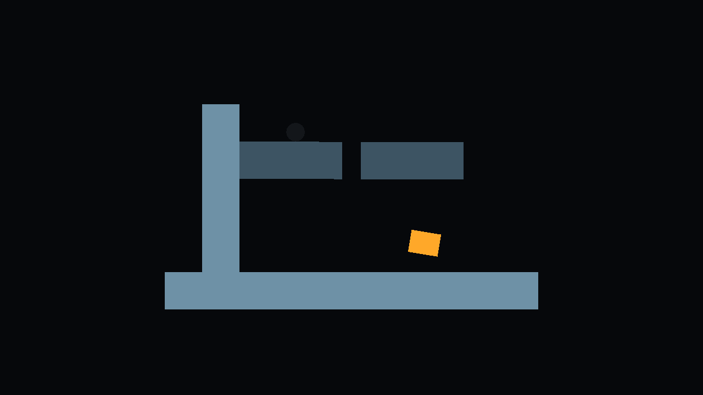

# Executed conformance evidence

Recorded on 2026-10-08 in Unity **6000.2.14f1**, exact isolated project:
`C:\Users\jblic\Desktop\Bomb\.worktrees\handbook-conformance`.
Source baseline `5960ed4e16efc5e3bf21489fb38b6ce429229c04`; normative handbook
`d9ac305f198162e5c20aabebd9c5fe7344f598d4`. See the
[implementation and coverage report](../HandbookConformance.md) for conventions,
ownership, rule IDs and limitations.

## Current results

- [EditMode result 4](editmode-result-4.json): 39 passed, zero failures/skips/inconclusive; [start and selection](editmode-start-4.json).
- [PlayMode result 5](playmode-result-5.json): 11 passed, zero failures/skips/inconclusive; [start and selection](playmode-start-5.json).
- [Saved scene verification](scene-verification-2.json): completed primary demonstration, C left/L right, P retired, active countdown, fixed support, five 2D projections and zero 3D bodies. Compare [first inspection](scene-verification-1.json) for advancing frames.
- [Restored Editor](editor-restored.json): exact project/version, conformance scene active, Play stopped, background setting restored to false.
- [Final console status](console-final.json): no compilation failure and zero errors; the one [recorded preview-cleanup warning](console-scene-warnings.json) is explained in the report and its orphan asset metadata is removed.
- [Handoff integrity](handoff-final.json): original checkout clean, exact isolated branch/base, settings/packages unchanged, new asset metadata and local report links checked.

The CLI `run_tests` start envelope reports zero tests while asynchronous execution
is **running**. Only the completed `test_status` result supplies pass counts.
Those result envelopes contain a JSON string at `data.result`; decode that string
to inspect individual test names, assertions, failures and duration.

## Recovered state and runtime measurements

- Test-run full current-state bundles: [before](primary-before.json), [after real split](primary-after.json), [post-recovery measurements](primary-measurements.json).
- Saved-scene full current-state bundles: [before](scene-before.json), [after real split](scene-after.json).
- Connector [rest fit](connector-rest-fit.json), [force failure](connector-force.json), [moment failure](connector-torque.json).
- Hold [normal load/reach](hold-reach.json) and [extreme solver limitation](hold-extreme-solver-limit.json).
- [Density mass/presentation independence](mass-and-presentation.json).
- [Reachable falling, held, timed bomb](reachable-bomb.json).
- [Captured preview](handbook-conformance.png); [capture response](scene-capture.json).

Measurements share one DTO. Fields unused by a case stay at default values and
must not be treated as failing assertions. The tests and report identify the
meaningful measurements. Examples: `frameAdvanced: false` in the connector-force
file means that field was not populated there; advancing frames are explicitly
verified in the primary reconstruction test and saved-scene inspections.

No connector or limb art is rendered. Their semantic records and derived joints
are inspected by tests and the scene verification script. The image shows the
current canonical meshes and appearance selections.

## Failed runs and reproduction

All EditMode runs 1-4 and PlayMode runs 1-5 retain start/result envelopes. They
document failures corrected during development and the final passes. The
`editmode-start-3.json` network error occurred during compilation reload;
`editmode-start-3-retry.json` is the accepted start for its completed result.
Floor/recovery diagnostic JSON and the exact C# inspection scripts are retained.
The initial additive scene-authoring refusal is described in the report; after
confirming the open default scene was clean, `CreateScene.cs` saved the dedicated
scene. The Editor's full historical log remains in `Temp/ConformanceEditor.log`
and is not part of this curated bundle.

Test invocation and collection commands are in the report. Eval scripts here are
evidence, outside `Assets`, and do not compile into the game. To repeat an inspection,
copy the relevant script to `Temp/ConformanceEvidence/` and run `unity command
eval_file` against the explicit isolated project. `InspectDemonstration.cs` checks
the deliberately paused final Play state; it throws if the expected graph or
runtime state is incomplete. The saved scene reproduces the primary case simply
by entering Play. Automated tests cover subsequent physics and bomb expiry.

The PNG was initially written by Pipeline under `Assets/Temp/ConformanceEvidence`
despite the project-relative request. It was copied here, and only that generated
image/import metadata and empty directories were removed. No test image asset
remains in the game.

[SHA256SUMS.txt](SHA256SUMS.txt) records artifact hashes; this index and the checksum
file itself are excluded. The local `.gitattributes` disables line-ending conversion
for captured JSON and the checksum file so their recorded byte hashes survive Git.
Later runs write to Temp and do not overwrite this
preserved bundle automatically. `handoff-final.json` records the uncommitted
verification checkpoint before the separately authorized commit and push of the
conformance branch. These raw verification artifacts are preserved unchanged.
